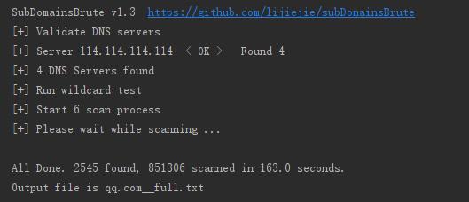

# subDomainsBrute 1.4 #

A fast sub domain brute tool for pentesters.

It works with Python3.5+ or Python2.7 while Python3 users can get better performance.

高并发的DNS暴力枚举工具。支持Python3.5+和Python2.7，使用Python3.5+ 效率更高。

## Install ##
Python3.5+ users:

* pip install aiodns

Python2 users 

* pip install dnspython gevent

## Screenshot ##

使用大字典，扫描qq.com

## Usage ##

	Usage: subDomainsBrute.py [options] target.com
	Options:
	  --version             show program's version number and exit
	  -h, --help            show this help message and exit
	  -f FILE               File contains new line delimited subs, default is
	                        subnames.txt.
	  --full                Full scan, NAMES FILE subnames_full.txt will be used
	                        to brute
	  -i, --ignore-intranet
	                        Ignore domains pointed to private IPs
	  -w, --wildcard        Force scan after wildcard test fail
	  -t THREADS, --threads=THREADS
	                        Num of scan threads, 256 by default
	  -p PROCESS, --process=PROCESS
	                        Num of scan Process, 6 by default
	  -o OUTPUT, --output=OUTPUT
	                        Output file name. default is {target}.txt

## Change Log 

* [2022-05-06]
  * 修复version check bug
* [2020-10-29]
  * 增加支持强制扫描泛解析的域名，需要加 `-w` 参数
* [2020-10-26]
  * 修复Windows下出现 `too many file descriptors`
* [2020-05-05]
  * 增加了Python3.5+支持。Python3执行效率更高
* [2019-05-19] 
  * Add wildcard test
  * Scan faster and more reliable, now can brute up to 3000 domains per second
* [2018-02-06] 
  * 添加多进程支持。 多进程 + 协程，提升扫描效率。 
  * 预处理了原字典中的占位符，提升扫描效率
* [2017-06-03] 
  * Bug fix: normal_lines remove deep copy issues, thanks @BlueIce
* [2017-05-04] 
  * 使用协程替代多线程； 使用优化级队列减小队列长度； 优化占位符支持

